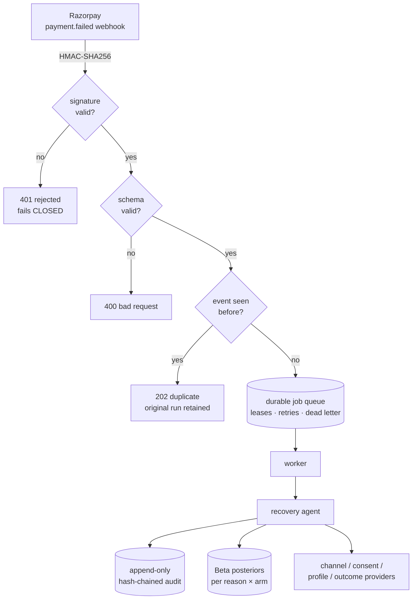
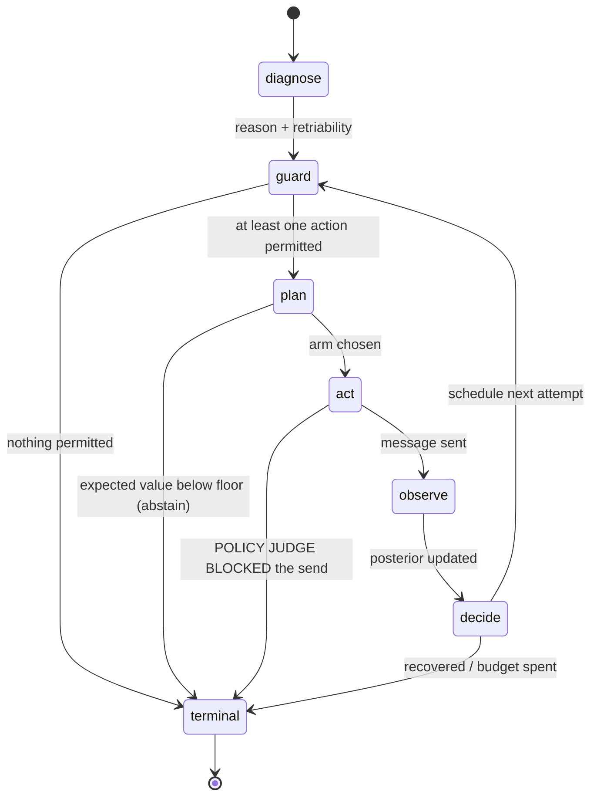

# Punar: architecture

Punar is an autonomous agent that recovers failed Razorpay payments under RBI
Fair-Practices constraints. This document describes what it is made of, why the
boundaries fall where they do, and what is deliberately not built yet.

---

## 1. Request path



The queue is durable rather than in-process because Razorpay retries webhooks and a
restart between the `202` and the recovery run would otherwise lose the payment
silently. Idempotency is keyed on the Razorpay event id, so a redelivery can never
drive a second round of customer contact. Without it the touch caps are unenforceable.

---

## 2. The agent state machine



Every transition appends to the audit trail. Three of these edges are the ones that
matter for a compliance review, and each is a real branch with a test behind it:

- **`guard → terminal`.** No permitted action exists, so nothing is attempted.
- **`plan → terminal`.** Every option destroys value, so the agent abstains. Without
  an abstention arm a "cost-aware" ranker still always acts.
- **`act → terminal`.** The policy judge rejected the copy, so nothing was sent, no
  touch was recorded, and the case went to a human.

---

## 3. Components

| layer | module | responsibility |
|---|---|---|
| **diagnose** | `core/taxonomy.py` | 11 decline classes; retriability and retry budget per class |
| | `core/classify.py` | error code + description + method → reason, with a confidence flag; accepts both the flat and nested Razorpay payload shapes |
| **guard** | `core/gate.py` | six checks, typed verdicts, every refusal logged |
| | `config/policy.json` | the single source of truth for guardrails, channels, costs, exemptions and backoffs |
| **plan** | `core/select.py` | Thompson sampling over Beta posteriors; EV = `p × amount − cost − annoyance`; abstention arm |
| | `core/bandit_store.py` | durable posteriors keyed `(reason, intervention)` |
| **act** | `core/copy.py` | en/hi/hinglish templates + the pre-send policy judge |
| **observe** | `core/agent.py` | posterior update written through to the store |
| **record** | `audit.py` | append-only, hash-chained, tamper-evident |
| **serve** | `api/server.py` | webhook, reads, health, Prometheus metrics |
| | `api/config.py` | validated settings; refuses to start when misconfigured |
| | `api/jobs.py` | durable queue: leases, retries, dead letters |
| | `api/providers.py` | protocols for the four external systems, plus labelled stubs |
| **measure** | `sim/world.py` | the world model, one scoring path for every arm |
| | `sim/arms.py` | do-nothing, naive, realistic, ablations, Punar |
| | `sim/params.py` | every modelling constant with its justification |
| | `sim/stats.py` | bootstrap CIs, paired permutation tests, effect sizes |

---

## 4. The guardrail gate

`allow_touch()` runs six checks in order and returns a typed `GateVerdict`. Order
matters: the cheapest and most absolute prohibitions come first.

| # | check | code on refusal |
|---|---|---|
| 1 | customer opted out / DND | `customer_opted_out` |
| 2 | decline is non-retriable | `non_retriable_decline` |
| 3 | outside 08:00–19:00 IST | `outside_contact_window` |
| 4 | daily customer-touch cap | `daily_touch_cap` |
| 5 | minimum inter-touch gap | `inter_touch_gap` |
| 6 | daily cost cap | `daily_cost_cap` |

**Non-contacting channels.** A silent PSP re-presentment and an internal escalation are
real recovery work but never reach the customer, so they must not consume the
customer's attention budget. Rather than special-casing them in code, each channel
declares its exemptions in `policy.json`:

```json
"silent_retry": {
  "contacts_customer": false,
  "exempt_from": ["quiet_hours", "daily_touch_cap", "inter_touch_gap"]
},
"internal_escalation": {
  "contacts_customer": false,
  "exempt_from": ["quiet_hours", "daily_touch_cap", "inter_touch_gap",
                  "opt_out", "non_retriable"]
}
```

This is the difference between a fraud block being *written off silently* and being
*routed to a human*. Only `internal_escalation` is exempt from the non-retriable block,
because it is the one action that does not re-present a dead instrument.

**Scheduling.** The next attempt is scheduled from the reason's backoff plus the
contact window, not a fixed interval. `insufficient_funds` waits 72 hours for a
payday credit; `upi_timeout` retries in 4 hours because it is a transient network
fault. A single hardcoded interval would place every attempt on its own calendar day
and quietly disable the daily cap, the inter-touch gap and the retry budget all at once.

---

## 5. Learning

The bandit keeps a Beta posterior per `(reason, intervention)`:

- **Selection.** Draw `p ~ Beta(α, β)` per arm, score
  `EV = p × amount − channel_cost − annoyance(touches) × intrusiveness`, take the
  argmax; abstain if the best EV is below the policy floor.
- **Update.** On an observed outcome, `α += 1` on success else `β += 1`, and write
  through to `bandit_store`.
- **Persistence is the point.** Seeding arms from a frozen prior on every call makes
  the sampler decorative: it can never depart from its prior no matter what it
  observes. The store is what turns a Beta sampler into a bandit.

Annoyance is scaled by the channel's intrusiveness. A penalty identical across all arms
is a constant offset that can never reorder an argmax; scaling it is what lets the agent
prefer a cheap, low-intrusion channel as a customer's patience is spent.

Inspect what it learned:

```bash
python -m punar.main learned          # CLI
curl -H "Authorization: Bearer $KEY" localhost:8000/bandit/posteriors
```

---

## 6. Audit trail

The compliance claim is that any decision can be reconstructed and that the record
cannot be quietly altered. Both are enforced, not asserted:

- **Append-only in fact.** Every state change is a new row. `BEFORE UPDATE` and
  `BEFORE DELETE` triggers make in-place mutation impossible even from a `sqlite3`
  shell.
- **Hash-chained.** Each row carries `prev_hash` and a `row_hash` over
  `(prev_hash, id, case_id, event_type, created_at, payload)`. `verify_chain()` detects
  edits, insertions, reorderings and deletions, including deletion of the head row.
- **Server-assigned ordering.** `created_at` is stamped by the process and ordering is
  by the monotonic row id, so caller-supplied data can never decide which revision is
  "latest".
- **No plaintext PII at rest.** Customer identifiers are pseudonymised with a keyed
  HMAC; message bodies are scrubbed of contact details and payment links. With
  `PUNAR_AUDIT_PII_MODE=encrypt` an authorised reader can recover them.
- **Retention.** `prune()` is the only sanctioned delete path and writes a checkpoint
  plus a `retention.prune` event, so the surviving chain still verifies end to end.

---

## 7. Measurement

Every arm, do-nothing, naive dunning, a realistic merchant baseline, the two ablations
and Punar, is scored by the **same** function in `sim/world.py`. No arm has a private
penalty or bonus branch. This matters more than any headline number: a comparison in
which the comparator is scored differently measures the author's thumb, not the policy.

Supporting decisions:

- **A do-nothing control**, because some failed payments self-cure and without that
  floor no arm's absolute recovery rate means anything.
- **Confidence intervals over 30 seeds by default**, because a single cohort says
  nothing about variance.
- **Paired permutation tests**, because the arms run on identical cohorts.
- **Ablations**, so the contribution of taxonomy vs guardrails vs bandit is measured
  rather than claimed.
- **Every constant printed** with `--show-params`, so assumptions travel with results.

Determinism: all randomness derives by SHA-256 from
`(seed, case_id, intervention, round)`, the benchmark clock is pinned, and nothing on
that path calls `datetime.now()` or the unseeded global `random`. Results are identical
across processes and `PYTHONHASHSEED` values.

---

## 8. Deliberately not built

Named plainly, because a reviewer should not have to discover them.

| gap | current behaviour | production path |
|---|---|---|
| Message delivery | `StubChannelSender` records the message, returns `delivered=False`, `simulated=True` | WhatsApp Business API / SMS gateway / SES behind the `ChannelSender` protocol |
| Outcome observation | seeded pseudo-outcome | correlate `payment.captured` webhooks back to the preceding touch; inherently asynchronous |
| Customer contact details | stub returns none | Razorpay Customer API or merchant CRM |
| Consent / DND | stub reads a configured list | merchant consent ledger + DNCR |
| Payment links | constructed `razorpay.me` URL | Razorpay Payment Links API |
| Multi-day scheduling | in-process queue | Celery / Temporal with delayed execution |
| Rate limiting | per-process buckets | shared Redis token buckets |
| Multi-tenancy | none | `merchant_id` on the audit table + per-tenant policy |

No response reports a simulated send as delivered. `providers.*.simulated` travels with
every audit record, `/health` and `/stats` response, so provenance is never lost.
