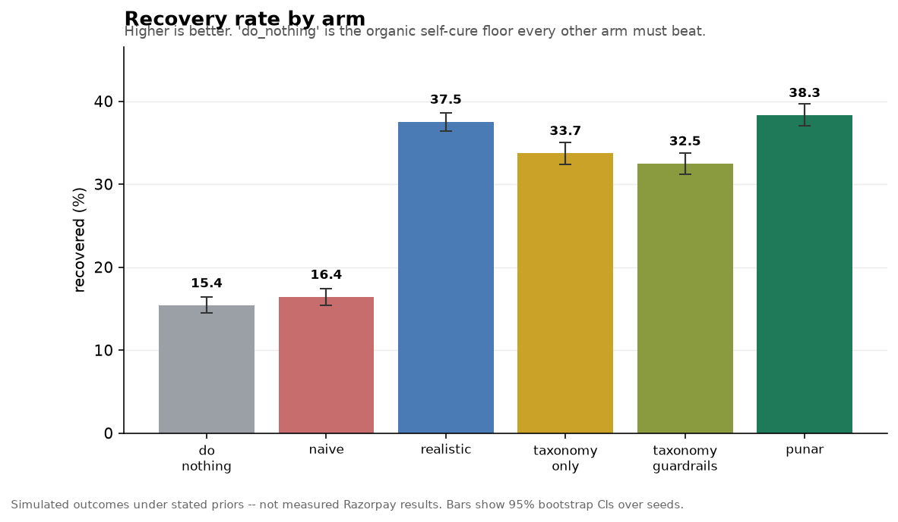
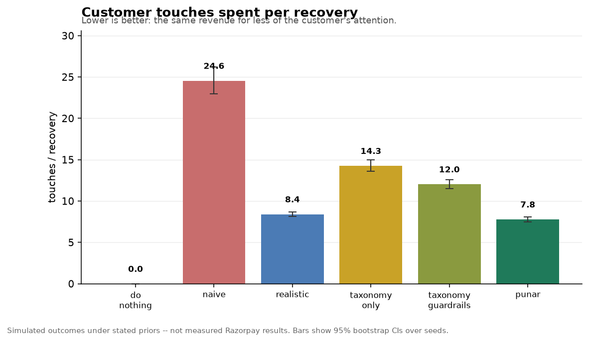
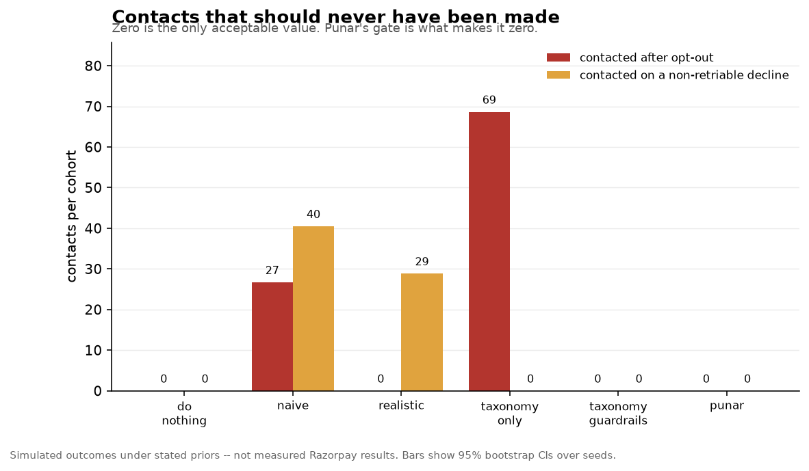
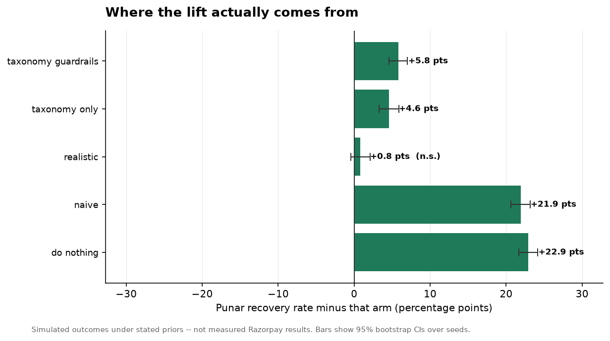
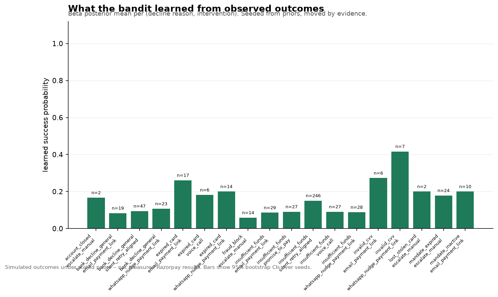

# Punar benchmark report

Generated 2026-08-29 05:57 | n=250 cases x 20 seeds (seeds 42..61)

> **These are simulated outcomes under stated priors, not measured Razorpay results.** Every arm is scored by the same world model in `punar/sim/world.py`; no arm has a private scoring branch. All intervals are 95% bootstrap CIs over seeds.

## Arms

| arm | what it does |
|---|---|
| `do_nothing` | Do nothing (organic self-cure control) |
| `naive` | Naive dunning (instant retries + generic email, no guardrails) |
| `realistic` | Realistic merchant baseline (scheduled retries + suppression + multi-channel) |
| `taxonomy_only` | Ablation: taxonomy routing only |
| `taxonomy_guardrails` | Ablation: taxonomy routing + guardrails |
| `punar` | Punar (taxonomy + guardrails + bandit) |

## Results

| arm | recovery rate | touches / recovery | opt-out contacts | non-retriable contacts | net revenue (INR) |
|---|---|---|---|---|---|
| `do_nothing` | 15.4% [14.5, 16.4] | 0.00 [0.00, 0.00] | 0 | 0 | 333,012 |
| `naive` | 16.4% [15.4, 17.4] | 24.55 [22.94, 26.20] | 27 | 40 | 361,023 |
| `realistic` | 37.5% [36.4, 38.6] | 8.41 [8.13, 8.69] | 0 | 29 | 799,983 |
| `taxonomy_only` | 33.7% [32.4, 35.0] | 14.26 [13.62, 14.96] | 69 | 0 | 688,093 |
| `taxonomy_guardrails` | 32.5% [31.2, 33.8] | 12.03 [11.50, 12.61] | 0 | 0 | 667,753 |
| `punar` | 38.3% [37.1, 39.7] | 7.79 [7.47, 8.09] | 0 | 0 | 758,088 |

## Punar vs each comparator

| comparator | recovery lift | p | effect size | net revenue delta |
|---|---|---|---|---|
| `do_nothing` | 22.9 pts [21.7, 24.1] | 0.0002 | dz=8.00 | 425,076 INR [374,314, 477,388] |
| `naive` | 21.9 pts [20.6, 23.2] | 0.0002 | dz=7.25 | 397,065 INR [339,676, 458,093] |
| `realistic` | 0.8 pts [-0.5, 2.1] | 0.2629 (n.s.) | dz=0.26 | -41,895 INR [-85,676, -1,707] |
| `taxonomy_only` | 4.6 pts [3.3, 5.9] | 0.0002 | dz=1.46 | 69,995 INR [19,396, 117,016] |
| `taxonomy_guardrails` | 5.8 pts [4.6, 7.0] | 0.0002 | dz=2.03 | 90,335 INR [35,946, 142,663] |

## Charts











## Modelling assumptions

Every constant that shapes these numbers, so none of them is hidden in the source:

| parameter | value |
|---|---|
| `amount_friction` | 0.16 |
| `amount_friction_ref_inr` | 1500.0 |
| `annoyance_inr_per_unwanted_touch` | 30.0 |
| `blockers` | {'insufficient_funds': ('liquidity', 0.085, 0.34, 0.05), 'upi_timeout': ('transient', 0.4, 0.1, 0.04), 'ban... |
| `channel_affinity_spread` | 0.45 |
| `channel_reach` | {'whatsapp': 0.7, 'sms': 0.52, 'voice': 0.33, 'email': 0.26, 'none': 1.0} |
| `churn_organic_mult` | 0.7 |
| `churn_touch_threshold` | 3 |
| `fatigue_any_channel` | 0.88 |
| `fatigue_same_channel` | 0.62 |
| `horizon_days` | 7 |
| `instant_retry_clear_mult` | 0.1 |
| `intent_alpha` | 4.0 |
| `intent_beta` | 3.0 |
| `language_match_lift` | 1.16 |
| `liquidity_alpha` | 2.5 |
| `liquidity_beta` | 2.5 |
| `off_window_reach_mult` | 0.55 |
| `optout_contact_effect` | 0.0 |
| `organic_intent_weight` | 0.55 |
| `organic_retry_rate` | 0.09 |
| `payday_days_of_month` | (1, 2, 3, 4, 5, 25, 26, 27, 28, 29, 30, 31) |
| `payday_liquidity_boost` | 2.1 |
| `payday_window_hours` | (17, 21) |
| `persuasion_base` | 0.82 |
| `retry_capture_rate` | 0.88 |

Reproduce with:

```bash
python scripts/benchmark.py --n-cases 250 --seed 42 --seeds 20
```
